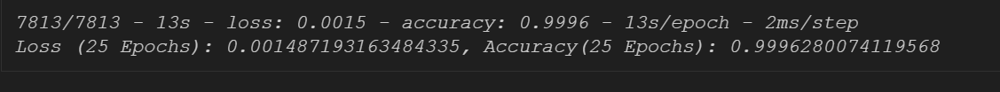
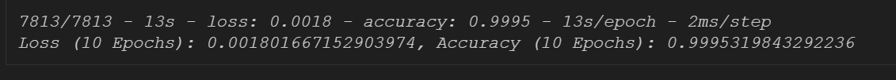

#    Flight Delay Predictions and Insights- Project 4  
                * By: Amanda Pham, Aldo Lee, Michael Cummings & Rupal Shah

 Flight is an essential mode of transportation in this century, allowing people to travel across far distances in a short amount of time. Our process of developing an accurate Machine Learning Model started with selecting the type of model and dataset we were interested in. 
 Ultimately, our group chose to engage with categorical data where we could utilize a classification model to predict from a preset number of outcomes. Our data is sourced from flight information which pertains to all on-time, cancelled and delayed flights by airline (and many other factors) dating back to January of 2018. The raw data set contained 61 columns and several million rows. The most recent 2022 flight data alone ranged from January 1st, 2022, to July 31st of 2022 containing 4,078,318 rows at just over 1.42 gigabytes of space.
    We chose to focus on the entirety of the 2022 flight data and engaged with it using Python, PySpark, and Tableau.To do the pre- processing of data we used MatPlotLib, Pandas, Numpy and Tableau to provide visualizations and insight on the trends, data types and information within the columns. 

# ## The objectives of this study are:

1.To identify the attributes that affect flight delays.
2.To develop machine learning models that classify flight outcomes (either delayed or not delayed or cancelled) with selected features.
3.To evaluate the performance of different machine learning models.

## Data Source:

The data was obtained from the "Flight Status Prediction" at Kaggle.com web page. The dataset consisting of flight information in the United States from 2018 to 2022.  In this study, the only data utilized was from the year 2022. The raw data set contained 61 columns and several million rows. The most recent 2022 flight data alone ranged from January 1st, 2022, to July 31st of 2022 containing 4,078,318 rows at just over 1.42 gigabytes of space.

# Data Preprocessing:

Note: The process was executed by Python, PySpark session in Google Colab and Tableau.

To facilitate the modeling process, the only flight data for year 2022 was considered and used to model the machine learning model. Data cleaning was performed on the Departure Delay, Arrival Delay and Cancelled Flights and also Destination was taken in consideration. Missing values or the values with Nan were replaced with 0. Attributes with more than 50% of missing values that did not provide helpful information to this analysis were dropped—unrelated attributes such as attributes that recorded the outcome of diverted flights were also removed. Since our main objective was to predict flight delay, arrival delay and cancelled flights, unnecessary columns were either dropped or just used necessary columns.

For classification purposes, a binary attribute, namely "DepDel15," was added to the record status of the flight and for multi-classsification attribute "cancelled flights", "DepDelay", "ArrDelays"is used. Before modeling, all categorical attributes such as destination airports, day of the week, flight carrier, and flight delay factors were converted to numerical variables via one hot encoding method. One dummy variable would be created for every object in the categorical variable. If the category is presented, the value would be denoted as one. Otherwise, the value would be denoted as zero.

## The following visualizations show some of our findings through data analysis 

# Model Initialization

Note: The process was executed by Python, PySpark session in Google Colab 

CatBoost (short for “Category Boosting”) is a powerful machine learning tool that's good at handling mixed types of data, efficiently training models, and making accurate predictions, especially in situations where there are both categorical and numeric features (e.g. Airline abbreviation vs flight number). It uses a technique called "Gradient Boosting." which creates multiple decision trees, sequentially, and combines their predictions to make a final prediction. Each tree corrects the mistakes of the previous ones.
 
This differs from Random Forest in that Random Forest is an ensemble learning method that combines the predictions of multiple decision trees in a non-sequential manner to make more accurate predictions. Since I was repeatedly overfitting and suffering from data leakage with high loss rates, I decided to investigate possible causes. I realized that the dataset already had numeric representations of the categorical airline abbreviations. I realized I didn’t need to waste extra processing resources to convert and encode those columns of data when I could just use another numeric column. As,realized we may have better results using deep learning, since the specific benefits of CatBoost weren’t really needed in this case.
 
Another model was created RandomForest model to generate a baseline accuracy.
From there, consecutive passes were a shuffling and reshuffling of the remaining columns to find the best configuration for my model. Categorical variables that contained geographic or flight data were encoded, binned or both; as encoding everything could create absolute monster DataFrames that resulted in 600+ columns. Finding the right balance between fidelity and size was a slow and iterative process.

Deep Machine Learning : Neural Network Model were also created to find the baseline accuracy using binary classification and multi classification. To facilitate the modeling process, the only flight data for year 2022 was considered and used to create a Deep Learning: Neural Network Model.. Data cleaning was performed on the Departure Delay, Arrival Delay and Cancelled Flights and also Destination was taken in consideration. Missing values or the values with Nan were replaced with 0. Attributes with more than 50% of missing values that did not provide helpful information to this analysis were dropped—unrelated attributes such as attributes that recorded the outcome of diverted flights were also removed. Since our main objective was to predict flight delay, arrival delay and cancelled flights, unnecessary columns were either dropped or just used necessary columns.

For classification purposes, a binary attribute, namely "DepDel15," was added to the record status of the flight and for multi-classsification attribute "cancelled flights", "DepDelay", "ArrDelays"is used. Before modeling, all categorical attributes such as destination airports, day of the week, flight carrier, and flight delay factors were converted to numerical variables via one hot encoding method. One dummy variable would be created for every object in the categorical variable. If the category is presented, the value would be denoted as one. Otherwise, the value would be denoted as zero.

Along with Neural Network , we also created a RandomForest model to generate a baseline accuracy.
From there, consecutive passes were a shuffling and reshuffling of the remaining columns to find the best configuration for my model. Categorical variables that contained geographic or flight data were encoded, binned or both; as encoding everything could create absolute monster DataFrames that resulted in 600+ columns. Finding the right balance between fidelity and size was a slow and iterative process.

# Feature Selection

Note: The process was executed by Python, PySpark

 Some variables were removed because they didn't provide useful information to the model. Constant variables (variables that have the same value for all data points) are typically removed as they don't contribute to the model's predictive power. In this group, several attributes were highly correlated. To select which attributes to remove, a random forest algorithm was utilized to determine their feature importance. 

# Modelling and Performance Evaluation

Neural Network Model was used and by iterative changes to model got following accuracy:
Epochs 25

Epochs 10

* CatBoost (short for “Category Boosting”) is a powerful machine learning tool that's good at handling mixed types of data, efficiently training models, and making accurate predictions, especially in situations where there are both categorical and numeric features (e.g. Airline abbreviation vs flight number). CatBoost uses a technique called "Gradient Boosting." which creates multiple decision trees, sequentially, and combines their predictions to make a final prediction. Each tree corrects the mistakes of the previous ones.
 
  * This differs from Random Forest in that Random Forest is an ensemble learning method that combines the predictions of multiple decision trees in a non-sequential manner and then converges the findings from the trees to make more accurate predictions. Since I was repeatedly overfitting and suffering from data leakage with high loss rates, I decided to investigate possible causes. I realized that the dataset already had numeric representations of the categorical airline abbreviations. I realized I didn’t need to waste extra processing resources to convert and encode those columns of data when I could just use another numeric column. Then I realized we may have better results using deep learning, since the specific benefits of CatBoost weren’t really needed in this case.

* We then chose to make predictions using a multi-class classification Neural Network Keras model. After removing all defined null values, I realized that most if not all of the columns pertaining to cancelled flights would be removed, creating a binary classification model with severe data loss. I then used Numpy to replace those null cells with a “0” placeholder, so the model could essentially ignore these cells while still taking into consideration the other relevant data to the model. Once I established a disposition code for each class (“0” for On-time, “1” for Delayed, and “2” for Cancelled), I then dropped the ‘Cancelled’ column to prevent overfitting. For further preprocessing, the data was binned, split the data into testing and training data and then scaled.

  * My first attempt was customized using 2 hidden layers with a low amount of neurons and the Relu activation method. The output layer used the ‘Softmax’ activation layer for its nodes, which is compatible with multi-class classification models because it transforms the raw model outputs into a probability distribution over multiple classes. 

  * The 2nd attempt used 25 epochs with no encoding since there was no categorical data. Since the accuracy is very high, we were concerned about overfitting, so we plotted learning curves to show the loss and accuracy between the testing and validation data across all epochs.

  * The third attempt was prompted by a discovery that certain columns may be contributing to the overfitting, so those columns were removed and as a result of the reduction to only 159 parameters, the following results were obtained. We can see due to high loss rates, the model underperforms.

  * Still leaving out the two columns in question, but adding more columns, 1 layer, almost 10 times more nodes and more diversity within the activation methods. My final attempt initially produced a high increasing accuracy rate and a low decreasing loss rate; however, as you can see from the Learning Curve, these favorable trends suddenly reversed indicating overfitting as the model increasingly struggled to perform well on the testing data. I decided to leave it here, since I had already achieved 75% in earlier versions, but I believe this model could be strengthened with less hidden layers and/or nodes. 

# Conclusion

